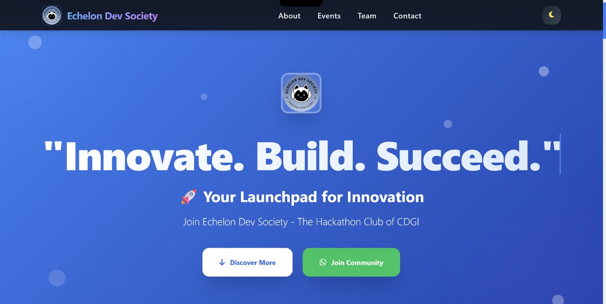

# 🚀 Echelon Dev Society – Landing Page

<p align="center">
  
</p>

## A **fully responsive, modern landing page** for **Echelon Dev Society** — _The Official Hackathon Club of CDGI._

## ✨ Features

✅ **Fully Responsive** — Works seamlessly on mobile, tablet & desktop  
🌗 **Dark/Light Mode** — Smooth theme toggle transitions  
🎞️ **Scroll Animations** — Powered by AOS.js  
🎨 **Modern UI** — Gradient backgrounds, subtle shadows & hover effects  
💬 **Functional Contact Form** — With validation & modal confirmation  
🔗 **Social Media Integration** — Direct links to EDS handles

```
## 🗂️ Project Structure

ECHELON-LANDING-PAGE/
├── index.html
├── assets/
│   ├── EDS Logo.webp
│   ├── Hack Wave 2.0.jpg
│   ├── Bootcamp.jpeg
│   ├── dev hacks.jpeg
│   ├── jigyarth.jpeg
│   ├── atharva.jpeg
│   └── tanishka.jpeg
└── README.md
```

## 🛠️ Technologies Used

- **HTML5** - Semantic markup
- **Tailwind CSS** - Utility-first CSS framework
- **JavaScript** - Interactive functionality
- **AOS.js** - Scroll animations
- **Font Awesome** - Icons

---

## 📋 Sections

1. **Header** - Navigation with logo and theme toggle
2. **Hero** - Eye-catching banner with call-to-action
3. **About** - Mission, activities, and benefits
4. **Events** - Showcase of past and upcoming events
5. **Team** - Team members with photos and roles
6. **Contact** - Contact form and social media links
7. **Footer** - Additional links and copyright

---

## 🎨 Customization

### Colors

- Primary: Blue (#3b82f6)
- Secondary: Purple (#8b5cf6)
- Background: Gradient themes

---

## 📱 Responsive Breakpoints

- **Mobile**: < 768px
- **Tablet**: 768px - 1024px
- **Desktop**: > 1024px

---

## 🚀 Getting Started

1. Clone the repository

```bash
git clone https://github.com/suyash-verma-AI/Echelon-Dev-Society-Landing-Page.git
```

2. Open index.html in your browser
3. Customize content and assets
4. Deploy to your favorite hosting platform (Netlify, Vercel, GitHub Pages, etc.)

🌐 Live Demo
[View Live project](https://echelon-dev-society.netlify.app/)

## 📞 Contact

- **Email**: echelondevsociety@gmail.com
- **WhatsApp**: [Join Community](https://chat.whatsapp.com/D2Qx7lofeFnLre9gsAU4mW)
- **Instagram**: [@echelondevsociety](https://www.instagram.com/echelondevsociety)
- **LinkedIn**: [Echelon Dev Society](https://www.linkedin.com/company/echelondevsociety)

## 📄 License

© 2025 Echelon Dev Society. All rights reserved.

---

Built with ❤️ by Echelon Dev Society Team
